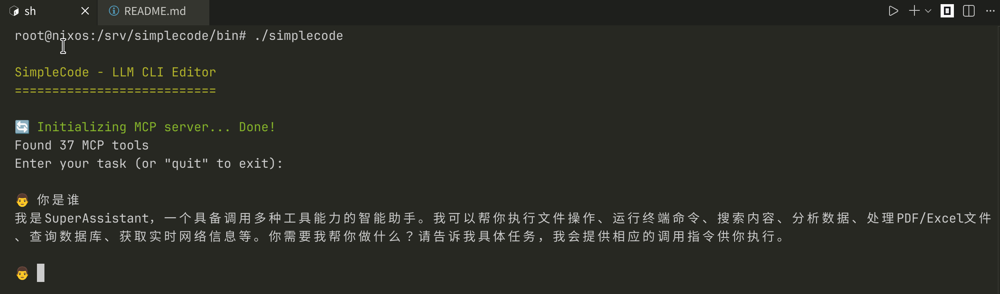

### `simplecode`基于`mcp`的 AI Agent 编码工具(php实现)

让不支持`tool`调用的模型响应`jsonl`格式的数据调用mcp工具实现`tool`的功能,如文件读写,命令执行等.

- 原理

```shell
# 链路
普通模型(Chat2API)+[mcphub.mcp]
# 数据通信
模型的jsonl给mcp,mcp返回结果给模型
# 配置文件
.simplecode.json
```
- mcphub需要配置的mcp,至少一个`desktop-commander`

```json
{
  "mcpServers": {
    "desktop-commander": {
      "command": "npx",
      "args": [
        "-y",
        "@wonderwhy-er/desktop-commander"
      ],
      "timeout": 6000000
    }
  }
}
```
- 运行

```shell
./bin/simplecode
```

- docker

```shell
docker run -it --rm --network host --name simplecode registry.cn-hangzhou.aliyuncs.com/jcleng/simplecode
```


